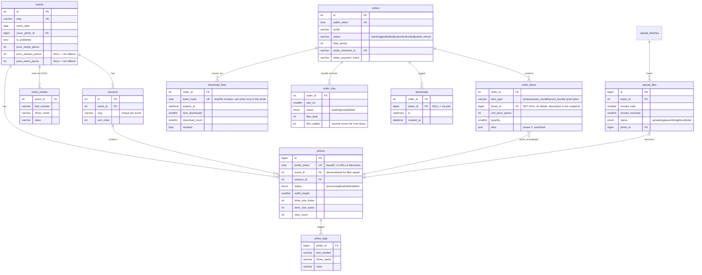

# PowerMedia Gallery — Architecture Decision Doc

Phase 1 deliverable. Nothing here is code; this is the contract the code will follow.
Stack: plain PHP 8.2+, MySQL, Apache + .htaccess, vanilla HTML/CSS/JS. Hosted on IONOS
shared hosting. Cron every 5 minutes. No daemons, no Node, no Redis, no framework.

---

## 1. Core decisions and why

| Decision | Rationale |
|---|---|
| Single front controller (`index.php`) with a small hand-rolled router | Clean URLs via one rewrite rule; one place for security headers, sessions, rate limiting. No framework. |
| High-res purchase files live **outside the web root**; only watermarked derivatives live under it | A guessable URL to a paid file is the worst failure. Unwatermarked bytes are physically unreachable by Apache. |
| Derivatives are served **directly by Apache** as static files with random-token filenames | Shared hosting PHP is the bottleneck. Derivatives are watermarked previews, so direct serving loses nothing; long-lived cache headers make mobile fast. |
| Watermark baked in at derivative generation | Nothing to strip by URL fiddling; the only unwatermarked file is outside the web root. |
| Guest checkout via **Stripe Checkout (hosted page)**, not embedded Stripe.js | Apple Pay / Google Pay for free, PCI burden stays with Stripe, and our pages can carry a strict CSP with no third-party script. |
| Order fulfilled **only** on verified webhook, never on redirect | Redirect is attacker-controllable. Success page polls order status and reveals the link only after the webhook marks it paid. |
| Cart in a signed (HMAC) cookie holding **IDs only** | Survives a locked phone with no account and no server-side session table. Prices are always re-read from the DB at checkout; the cookie can't set a price. |
| Download access = DB-backed random token (stored hashed) + per-file short-lived HMAC URLs | DB-backed gives expiry, download caps and admin revocation; HMAC per-file links mean the streaming endpoint does no session work. |
| Background work = `jobs` table drained by a 5-minute cron, plus an optional browser-assisted drain from the admin panel | Only queue primitive shared hosting allows. The admin page can pump jobs via AJAX while Harry watches an upload, so derivatives don't wait for cron ticks. |
| Money is integer pence everywhere | No floats near payments. Prices treated as VAT-inclusive gross; no tax logic (flag to revisit if the business registers for VAT). |
| Image processing: Imagick if `class_exists('Imagick')`, else GD | Runtime detection; a build that dies on a missing extension is useless on shared hosting. |

Optional, suggested-not-required Composer packages, each gated behind a
`class_exists()` check so a host that never opts in sees zero behavior
change and never needs to install anything (see `app/lib/sftp.php` for the
pattern): `phpseclib/phpseclib` (remote admin mode's SFTP push) and
`phpmailer/phpmailer` (SMTP delivery of receipts/links, once SMTP settings
are actually filled in — otherwise mail() is the default and the right
choice for most shared hosting). Stripe is a hand-rolled curl wrapper
(`app/lib/stripe.php`), not the `stripe/stripe-php` SDK — no Stripe
dependency is vendored at all. TOTP is ~60 lines of RFC 6238, hand-rolled
with test vectors, also no dependency.

---

## 2. Directory layout

IONOS lets a subdomain's docroot point at a subfolder of the webspace, so everything outside
`public/` is unreachable by URL. Belt-and-braces: `storage/` and `config/` also carry a
`.htaccess` with `Require all denied` in case the docroot is ever misconfigured.

```
/ (webspace root — NOT web-accessible)
├── app/                      # all PHP source
│   ├── bootstrap.php         # config load, PDO, error handling, autoload
│   ├── router.php
│   ├── controllers/          # public/, admin/, webhook
│   ├── lib/                  # db, auth, totp, csrf, ratelimit, images, watermark,
│   │                         #   signer (HMAC), cart, mailer, stripe, jobs, audit
│   └── views/                # PHP templates: public/, admin/, email/
├── config/
│   └── config.php            # secrets: DB, Stripe keys, HMAC keys, SMTP. NEVER in repo.
│   └── config.example.php    # committed template
├── cron/
│   └── run.php               # single cron entry point (CLI or secret-URL invocation)
├── migrations/               # numbered .sql files + tiny runner (admin-only page)
├── storage/                  # outside docroot
│   ├── hires/{event_id}/{photo_token}.jpg    # purchase-grade files
│   ├── zips/{order_id}/part-N.zip            # built bundle archives
│   └── tmp/uploads/{file_id}/                # chunk staging
├── vendor/                   # committed/uploaded, composer install run locally
└── public/                   # docroot of gallery.powerrmediaa.com
    ├── index.php             # front controller
    ├── .htaccess             # rewrite, security headers, cache rules
    ├── assets/               # css/, js/ (plain files, no build step)
    └── media/
        └── d/{photo_token}-{w}.jpg           # watermarked derivatives (Apache-served)
```

Originals (RAW/full shoot) stay on the NAS. The host stores exactly two things per photo:
one purchase-grade high-res JPEG outside the docroot, and three watermarked derivatives inside it.

### URL scheme (every gallery view is link-addressable)

```
/                                  home: published events, newest first, season archive
/e/{event-slug}                    event page: sessions, prices, filter bar
/e/{event-slug}/{session-slug}     session grid
   ?kart=23&driver=smith&class=junior   filters live in the query string (copy/paste-able)
/api/photos?...                    same filters, returns HTML fragment for no-reload filtering
/cart, /checkout, /order/{orderToken}   cart page, checkout POST, post-payment status page
/d/{linkToken}                     download page (from the email)
/d/{linkToken}/f/{photoToken}?e=...&s=...   per-file fetch, short-lived HMAC
/stripe/webhook                    webhook receiver
/admin/...                         admin panel
/cron/{secret}                     HTTP fallback for cron (IONOS crons are URL-based on some plans)
```

Filtering is progressive enhancement: the server renders the full filtered grid for any URL
(so shared links work with JS off), and the filter bar re-fetches `/api/photos` + `history.pushState`
for the no-reload experience.

---

## 3. Schema

Full DDL in `migrations/001_initial_schema.sql`. utf8mb4, InnoDB, integer pence,
token columns are `ascii_bin` (case-sensitive — base62 tokens must not collide case-insensitively).



Supporting tables (not drawn): `admin_users` (single row; password hash, TOTP secret, last-used
TOTP step for replay protection), `jobs` (type, JSON payload, status, attempts, run_after),
`webhook_events` (Stripe event ID primary key = idempotency), `rate_limits` (bucket + key +
window counters), `audit_log` (actor, action, entity, meta JSON, IP), `stats_daily`
(date + event: gallery views, photo views), `settings` (key/value: default prices, watermark
config), `migrations` (applied filenames).

### Schema decisions worth reviewing

- **`photo_tags` is a separate table, multiple rows per photo.** A battle shot contains two
  karts; a photo tagged 23 *and* 47 should appear in both drivers' filtered links. Rows are
  denormalised (kart + driver + class together) so filter queries need one join and bulk tagging
  stays a simple insert.
- **`event_entries` holds the CSV-imported entry list.** Tagging a kart number auto-fills driver
  and class from it. It's a lookup aid, not an integrity constraint.
- **`order_items.item_type` is a VARCHAR, not an ENUM**, and carries nullable `photo_id` /
  `session_id` / `event_id`, `quantity`, and a JSON `attrs` column. Phase 2 prints become new
  rows with `item_type='print'` and `attrs={"size":"A3","finish":"lustre"}` — no ALTER that
  rewrites `orders`. A shipping-address table and per-item fulfilment status are additive later.
- **`order_items.description` snapshots what was sold** and `photo_id` is `ON DELETE SET NULL`,
  so deleting a photo or event never corrupts order history.
- **Bundle entitlement is evaluated at download time**: a session bundle grants every *live*
  photo in that session when the customer downloads, so photos uploaded after purchase are
  included (generous, and simpler than snapshotting membership). The pre-built zip contains the
  photos live at fulfilment; the download page always lists the current set.
- **`photos.event_id` is denormalised** (session already implies it) so the hot filter query —
  photos in event X with kart tag Y — is one indexed join, no three-table hop.

---

## 4. Request flows

### Browse (public)

1. `GET /e/club100-rye-june` — PHP renders event page server-side: sessions, prices up front,
   filter bar, first grid page. One query for photos + one for tags. No client framework.
2. Grid `` tags carry `srcset` (400/800/1600 w), `loading="lazy"`, fixed aspect-ratio boxes
   (no layout shift). Derivatives served by Apache with `Cache-Control: public, max-age=31536000, immutable`.
3. Filter change → JS fetches `/api/photos?event=…&kart=23` → server returns the grid as an HTML
   fragment → swap + `history.pushState`. The address bar is always a shareable deep link; Harry
   copies it into a WhatsApp DM and it lands anyone on the same filtered view, JS or not.
4. Lightbox: opens 1600w derivative, preloads both neighbours, swipe (touch events) + arrow keys,
   add-to-cart button, fires a view beacon (`stats_daily.photo_views`, `photos.view_count`).

**First-contentful-paint target: ≤ 1.8 s** on Lighthouse's mobile preset (Moto G-class CPU
throttle, 4G network throttle), measured against the event page with a 200-photo session.
How the design gets there: server-rendered HTML (no JS before paint), one small CSS file inlined
critical-path, no web fonts above the fold (system stack + one display font `font-display: swap`),
lazy images below the fold, thumbnails ≈ 25 KB each. Verified in phase 3 with Lighthouse runs
against the IONOS-hosted staging URL, numbers reported in the handover doc — not assumed.

### Buy

1. `POST /cart/add {photo_token | bundle ref}` → server validates the ID exists and is live,
   rewrites the signed cart cookie (HMAC-SHA256 over the ID list + expiry; IDs only, never
   prices). SameSite=Lax; a forged cart-add is harmless, so cart endpoints skip CSRF tokens —
   checkout and all admin mutations do carry them.
2. Cart page shows running total and the bundle nudge ("6 more photos and the session bundle is
   cheaper") computed from DB prices.
3. `POST /checkout {email}` → validate every cart ID against the DB, price the lines from the
   DB, create `orders` row (status `pending`) + `order_items`, create a Stripe Checkout Session
   (GBP, `automatic_payment_methods` → Apple/Google Pay, `customer_email`,
   success URL `/order/{orderToken}`), 303 redirect to Stripe.
4. **Webhook** `POST /stripe/webhook`: verify `Stripe-Signature` against the endpoint secret;
   insert Stripe event ID into `webhook_events` (duplicate key = already processed, return 200).
   On `checkout.session.completed` (paid): mark order `paid`, create the `download_link`
   (random 32-byte token; only its SHA-256 stored), queue zip-build jobs for any bundle items,
   send the delivery email inline (queued as a job on SMTP failure so the webhook still 200s fast).
5. Success page `/order/{token}` polls a status endpoint every 2 s; shows the download link only
   once the **webhook** has flipped the order to paid. The redirect itself grants nothing.
   `pending` orders older than 24 h are marked `expired` by cron — that's the abandoned-checkout
   stat, for free.
6. Refund: admin action calls Stripe's refund API, marks the order, optionally revokes links.
   `charge.refunded` webhook also handled so refunds issued from the Stripe dashboard reconcile.

### Download

1. Email contains `https://…/d/{linkToken}` — the only long-lived secret. Lookup is by
   `sha256(linkToken)`; check `revoked`, `expires_at` (default 30 days, admin-extendable),
   order status still `paid`.
2. The download page lists purchased photos (and zip parts for bundles). Each file button is a
   short-lived URL: `/d/{linkToken}/f/{photoToken}?e={expiry}&s=HMAC(secret, linkId|photoToken|e)`
   valid ~15 minutes — no way to mint one without the server key, nothing stored per URL.
3. The file endpoint re-checks the link row, verifies the HMAC and expiry, verifies the photo
   belongs to the order's entitlement, enforces `download_count < max_downloads` (default:
   5 × item count — generous; the cap exists to stop a leaked link becoming a public mirror),
   increments the count, appends a `downloads` row (photo, IP, UA), then streams the high-res
   file from `storage/hires/` in chunks with the right `Content-Type`/`Content-Length`/
   `Content-Disposition`. PHP is the only path to those bytes.

### Upload → derivatives (admin)

1. Admin drags a folder per session onto the upload page. JS slices each file into **2 MB chunks**
   (safely under any IONOS `post_max_size`), registers an `upload_files` row, then POSTs chunks
   sequentially with 3 automatic retries per chunk.
2. Server appends each chunk to `storage/tmp/uploads/{file_id}/` and bumps `chunks_received`.
   State lives in the DB, so a browser crash at photo 900 of 1,200 resumes exactly there: the
   page reloads the batch, sees per-file status, and re-sends only missing chunks of unfinished
   files. Per-file status and per-file retry in the UI.
3. On final chunk: assemble, validate by content (`finfo` MIME + `getimagesize` must agree it's a
   real JPEG/PNG, dimensions sane), extract EXIF taken-at, move to
   `storage/hires/{event}/{token}.jpg` with a **generated name** (client filename is data, never
   a path), create the `photos` row (`processing`), queue a `derivative` job.
4. Derivative job (cron or browser-assisted drain): generate 400/800/1600 px progressive JPEGs,
   composite the watermark (settings: logo, opacity, scale, position; applied at ≥ 800 px —
   a 400 px thumb is too small to steal and a watermark ruins it), write to `public/media/d/`,
   record byte sizes for the per-event storage accounting, flip photo to `live`.

Throughput honesty: GD on shared hosting ≈ 3–5 s per photo for three sizes, so 1,200 photos
by cron alone is hours. The upload page therefore pumps `/admin/jobs/run` via AJAX while it's
open (each call drains jobs for ~20 s), which brings a 1,200-photo event to roughly an hour of
leaving the tab open, and cron finishes whatever remains. Flagged below as an IONOS compromise.

---

## 5. Cron design

One schedule, every 5 minutes. IONOS crons are URL-invoked on some plans, CLI on others, so
`cron/run.php` accepts both: CLI, or `GET /cron/{CRON_SECRET}` (secret from config; 404 otherwise).

- **Lock**: MySQL `GET_LOCK('pm_cron', 0)` — exit immediately if the previous run holds it.
  No filesystem locks (NFS-ish shared storage makes them unreliable).
- **Time budget**: 50 s soft limit (URL-invoked crons die ~60 s). Loop: claim next runnable job
  (`UPDATE … SET status='running', locked_at=NOW() WHERE status='pending' AND run_after<=NOW()
  ORDER BY id LIMIT 1` — claim-by-update, no race), run it, repeat until budget spent.
- **Retries**: failure increments `attempts`, sets `run_after` with backoff; 3 strikes → `failed`
  + surfaced on the admin dashboard. Jobs `running` for > 10 min (killed mid-run) are reclaimed.
- **Job types**: `derivative` (one photo), `zip_build` (see below), `email` (queued/retry sends),
  `cleanup` (daily: stale chunk dirs > 48 h, expire pending orders > 24 h, delete zips for
  expired links), .
- **`zip_build` is time-sliced**: each execution opens the order's zip part, appends up to N
  files (~30 s worth), updates `files_added`, and re-queues itself until done. Parts capped at
  ~1 GB (`part-1.zip`, `part-2.zip`, …) — one 6 GB archive is un-buildable and un-downloadable
  on a phone; parts also give resumable customer downloads. Photos are already-compressed JPEGs,
  so parts use store-only (no deflate) — appends are pure I/O and fast.

---

## 6. Security requirements → enforcement map

| Requirement | Enforcement |
|---|---|
| High-res unreachable by URL | Stored in `storage/hires/` outside the docroot; only `download.php` streams it after token + HMAC + entitlement + cap checks. `storage/` additionally carries deny-all `.htaccess`. |
| Signed download links | 32-byte random token, SHA-256 hash stored (a DB leak leaks no live links); `expires_at`; `max_downloads` counter; `revoked` flag toggled from admin. Per-file URLs are 15-min HMACs — expiry and signature checked before any file read. |
| Webhook trust | `\Stripe\Webhook::constructEvent` signature verification with the endpoint secret; fulfilment happens only there; `webhook_events` PK makes processing idempotent; redirect page is display-only. |
| SQLi / XSS | PDO prepared statements exclusively (no string-built SQL anywhere); all template output through an `e()` = `htmlspecialchars` helper; JSON endpoints send `Content-Type: application/json`. |
| Headers | Sent centrally in the front controller: CSP `default-src 'self'; img-src 'self' data:; form-action 'self' https://checkout.stripe.com; frame-ancestors 'none'` (no third-party JS anywhere, so no CSP holes), `X-Frame-Options: DENY`, `X-Content-Type-Options: nosniff`, `Referrer-Policy: strict-origin-when-cross-origin`. |
| Rate limiting | `rate_limits` table, fixed-window counters per bucket+key: login (5/15 min per IP **and** per account, with constant-time failure responses), checkout (10/h per IP), download page + file fetches (30/h per link), TOTP attempts. |
| Admin auth | Argon2id (`PASSWORD_ARGON2ID`) password; TOTP (RFC 6238, ±1 step, last-used step stored so a code can't replay); session regenerated on login, `HttpOnly; Secure; SameSite=Strict` cookie; CSRF token (per-session, `hash_equals`) required on every mutating admin request; audit log on every admin action. |
| Upload validation | Content sniffed via `finfo` + `getimagesize` (both must agree; extension is ignored); generated storage names; chunk staging outside docroot; assembled files never executed or served in place. |
| Secrets | `config/config.php` outside the docroot, `chmod 600`-equivalent, listed in `.gitignore`; `config.example.php` committed. Stripe keys, HMAC keys, SMTP, cron secret all live there. |

---

## 7. Where IONOS forced a compromise

1. **Derivative throughput.** No workers means big uploads finish processing in hours by cron
   alone. Mitigated with the browser-assisted job drain (admin tab open ≈ continuous worker).
   Accepted: Harry uploads after an event, not mid-race.
2. **Bundle zips are prepared asynchronously and split into ~1 GB parts.** A full-event archive
   can't be built in one 60 s request nor comfortably downloaded as one file. The delivery email
   sends immediately; single photos download instantly; the download page shows zip parts as
   "preparing…" until cron finishes (typically minutes with the admin drain, worst case ~an hour
   for a huge event). Individual files are always available meanwhile, so "instant delivery"
   holds for what people actually buy most.
3. **Email deliverability** rides IONOS SMTP via PHPMailer. Good enough for receipts; if delivery
   proves flaky, the swap is an SMTP relay's credentials in config, not a code change.
4. **No opcache/php.ini control guarantees.** Settings that matter (`upload_max_filesize`,
   `post_max_size`, `max_execution_time`, `memory_limit ≥ 256M` for 24 MP images in GD) are
   checked by an admin "environment" page at deploy time rather than assumed; chunk size (2 MB)
   is chosen to work even at the stingiest defaults.
5. **Cron may be URL-based** → the runner is dual-mode with a secret path and the same 50 s
   budget either way.

---

## 8. Phase 2 (prints) — schema hooks already in place

Not built now: `order_items.item_type` VARCHAR + JSON `attrs` + `quantity` accept a print line
today. Adding prints later means: new `addresses` table + nullable `orders.shipping_address_id`,
an `order_items.fulfilment_status` column (additive ALTERs, no row rewrites), print product
config per event, and cart/checkout UI. Full list goes in the handover doc as required.

---

## 9. Build order (agreed checkpoints)

1. ✅ This doc + `migrations/001_initial_schema.sql` — **stop for review (you are here)**
2. Admin panel: auth (password + TOTP), event/session CRUD, chunked upload, tagging + CSV import, derivative pipeline, cron runner
3. Public gallery: home, event, session grid, filters, lightbox, FCP verification
4. Cart, Stripe Checkout, webhook, delivery, download endpoint, zips
5. Stats dashboard, audit surfacing, hardening pass + the security test plan, deploy guide, handover doc
